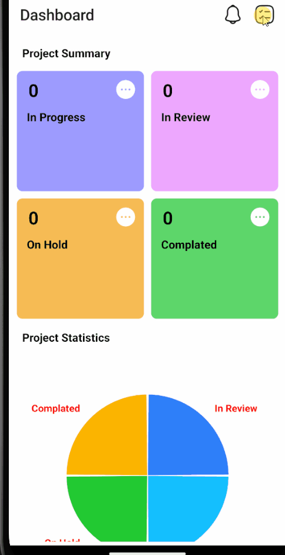

# R.NATIVE-REDUX-TASKAPP-WORK

<h4>
Proje Hakkında

Bu proje, React Native ve Redux kullanılarak geliştirilmiş bir görev yönetim uygulamasıdır.
Kullanıcılar, projelerin durumlarını takip edebilir ve istatistiklerini görebilir.

Kullanılan Teknolojiler
Redux: Uygulama durum yönetimi için.

Özellikler
Görevlerin duruma göre kategorize edilmesi:
In Progress, In Review, On Hold, Completed.
Grafik gösterimi ile proje istatistiklerini görselleştirme.
Responsive tasarım ve kullanıcı dostu arayüz.

</h4>

